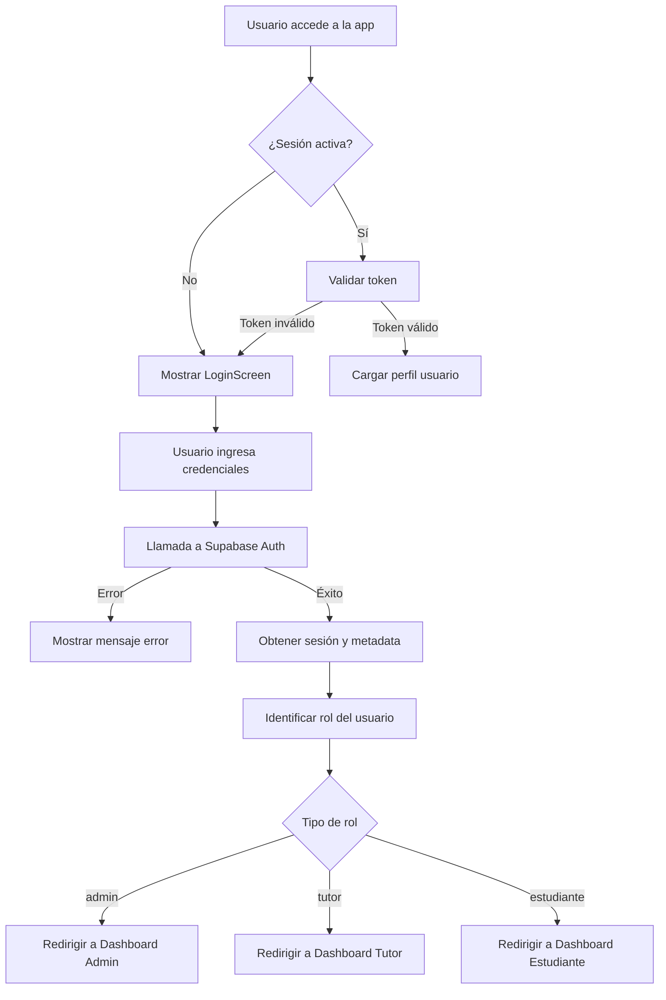
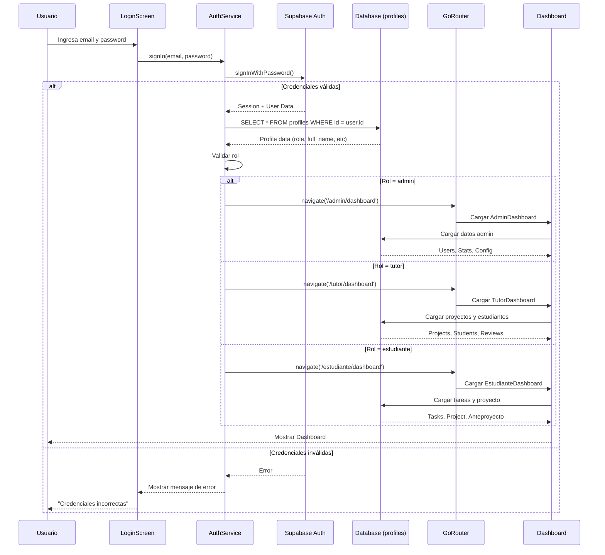

# 🔐 ARQUITECTURA DEL SISTEMA DE AUTENTICACIÓN

Este documento describe la lógica del ciclo de vida del login, los flujos de autenticación y las credenciales de prueba para el Sistema de Seguimiento de Proyectos TFCGS.

---

## 📐 ARQUITECTURA DEL CICLO DE VIDA DEL LOGIN

### **1. FLUJO GENERAL DE AUTENTICACIÓN**



### **2. ESTADOS DEL CICLO DE VIDA**

#### **Estado 1: Inicialización**
- La aplicación verifica si existe una sesión activa mediante `Supabase.instance.client.auth.currentSession`
- Si existe sesión, se valida el token JWT
- Si no existe o es inválido, se redirige a `LoginScreen`

#### **Estado 2: Autenticación**
```dart
// Proceso de autenticación
final response = await Supabase.instance.client.auth.signInWithPassword(
  email: email,
  password: password,
);
```

#### **Estado 3: Validación de Rol**
- Se obtiene el metadata del usuario desde `response.user?.userMetadata`
- Se extrae el campo `role` que determina el tipo de usuario
- Se valida contra los roles permitidos: `admin`, `tutor`, `estudiante`

#### **Estado 4: Navegación Post-Login**
- Basado en el rol, se redirige usando `GoRouter`
- Se inicializa el estado global del usuario
- Se cargan los datos específicos del rol

#### **Estado 5: Sesión Activa**
- La sesión se mantiene mediante tokens JWT
- Se implementa refresh automático de tokens
- Se escuchan cambios en el estado de autenticación mediante `onAuthStateChange`

#### **Estado 6: Cierre de Sesión**
```dart
await Supabase.instance.client.auth.signOut();
// Limpieza del estado local
// Redirección a LoginScreen
```

---

## 🎭 LÓGICA ESPECÍFICA POR ROL

### **🔴 ADMINISTRADOR**

#### **Permisos y Acceso**
- Acceso completo a todas las funcionalidades del sistema
- Gestión de usuarios (CRUD)
- Configuración global del sistema
- Visualización de métricas y reportes generales

#### **Navegación Post-Login**
```dart
routes: [
  '/admin/dashboard',          // Panel Principal
  '/admin/notifications',      // Notificaciones
  '/admin/users',              // Gestionar Usuarios
  '/admin/settings',           // Configuración del Sistema
]
```

#### **Validaciones Específicas**
- Se verifica el flag `is_admin` en la base de datos
- Se cargan permisos administrativos desde la tabla `profiles`
- Se habilitan controles de auditoría y logs

#### **Estado Global**
```dart
AdminState {
  userId: String,
  role: 'admin',
  fullName: String,
  email: String,
  permissions: List<String>,
  lastLogin: DateTime,
}
```

---

### **🟢 TUTOR**

#### **Permisos y Acceso**
- Gestión de proyectos asignados
- Revisión y aprobación de anteproyectos
- Asignación de tareas a estudiantes
- Seguimiento del progreso de sus estudiantes

#### **Navegación Post-Login**
```dart
routes: [
  '/tutor/dashboard',              // Panel Principal
  '/tutor/notifications',          // Notificaciones
  '/tutor/anteproyectos',          // Anteproyectos por revisar
  '/tutor/estudiantes',            // Mis Estudiantes
  '/tutor/flujo-aprobacion',       // Flujo de Aprobación
]
```

#### **Validaciones Específicas**
- Se obtienen los proyectos asignados desde la tabla `projects` donde `tutor_id = current_user_id`
- Se cargan los estudiantes bajo su supervisión
- Se filtran anteproyectos pendientes de revisión

#### **Estado Global**
```dart
TutorState {
  userId: String,
  role: 'tutor',
  fullName: String,
  email: String,
  assignedProjects: List<Project>,
  students: List<Student>,
  pendingReviews: int,
}
```

#### **Carga de Datos Post-Login**
1. Obtener proyectos asignados
2. Cargar lista de estudiantes supervisados
3. Contar anteproyectos pendientes de revisión
4. Cargar notificaciones no leídas

---

### **🔵 ESTUDIANTE**

#### **Permisos y Acceso**
- Creación y edición de anteproyectos
- Gestión de tareas asignadas
- Visualización del tablero Kanban personal
- Seguimiento del progreso del proyecto

#### **Navegación Post-Login**
```dart
routes: [
  '/estudiante/dashboard',         // Panel Principal
  '/estudiante/notifications',     // Notificaciones
  '/estudiante/anteproyectos',     // Mis Anteproyectos
  '/estudiante/proyectos',         // Proyectos (aprobados)
  '/estudiante/tareas',            // Mis Tareas
  '/estudiante/kanban',            // Tablero Kanban
]
```

#### **Validaciones Específicas**
- Se obtiene el proyecto actual del estudiante
- Se cargan las tareas asignadas con sus estados
- Se verifica el estado del anteproyecto (pendiente, aprobado, rechazado)

#### **Estado Global**
```dart
EstudianteState {
  userId: String,
  role: 'estudiante',
  fullName: String,
  email: String,
  currentProject: Project?,
  assignedTasks: List<Task>,
  anteproyectoStatus: String?,
  tutorId: String?,
}
```

#### **Carga de Datos Post-Login**
1. Verificar si tiene anteproyecto creado
2. Obtener proyecto aprobado (si existe)
3. Cargar tareas asignadas y su progreso
4. Obtener información del tutor asignado
5. Cargar notificaciones recientes

---

## 🔄 MANEJO DE ERRORES Y CASOS ESPECIALES

### **Errores de Autenticación**
| Error | Mensaje | Acción |
|-------|---------|--------|
| `invalid_credentials` | Credenciales incorrectas | Mostrar error, permitir reintento |
| `email_not_confirmed` | Email no confirmado | Ofrecer reenvío de confirmación |
| `user_not_found` | Usuario no encontrado | Mostrar error genérico (seguridad) |
| `network_error` | Sin conexión | Mostrar mensaje de conectividad |
| `invalid_role` | Rol no asignado | Contactar administrador |

### **Validaciones de Sesión**
```dart
// Listener de cambios de autenticación
Supabase.instance.client.auth.onAuthStateChange.listen((data) {
  final session = data.session;
  
  if (session == null) {
    // Sesión expirada o cerrada
    _navigateToLogin();
  } else {
    // Sesión activa, actualizar estado
    _updateUserState(session);
  }
});
```

### **Casos Especiales**
1. **Usuario sin rol asignado**: Redirigir a página de error con mensaje de contacto al administrador
2. **Token expirado**: Intentar refresh automático, si falla, cerrar sesión
3. **Múltiples sesiones**: Mantener solo la más reciente (configuración de Supabase)
4. **Cambio de rol en sesión activa**: Forzar cierre de sesión y nuevo login

---

## 🛡️ SEGURIDAD Y MEJORES PRÁCTICAS

### **Almacenamiento Seguro**
- Tokens almacenados en almacenamiento seguro del dispositivo (Shared Preferences encriptado)
- Contraseñas nunca almacenadas localmente
- Session cookies con flags `HttpOnly` y `Secure`

### **Protección de Rutas**
- Middleware de verificación de rol en todas las rutas protegidas
- Redirección automática si el usuario intenta acceder a rutas no autorizadas
- Validación server-side mediante Row Level Security (RLS) en Supabase

### **Políticas de Sesión**
- Tiempo de expiración: 1 hora (configurable)
- Refresh token válido por 7 días
- Cierre automático de sesión tras inactividad de 30 minutos
- Límite de intentos de login: 5 intentos / 15 minutos

## 🧪 PRUEBAS Y VALIDACIÓN DEL CICLO DE VIDA

### **Escenarios de Prueba por Rol**

#### **Test 1: Login de Administrador**
1. Iniciar sesión con credenciales de admin
2. Verificar redirección a `/admin/dashboard`
3. Validar carga de permisos administrativos
4. Comprobar acceso a gestión de usuarios
5. Verificar que no puede acceder a rutas de tutor/estudiante

#### **Test 2: Login de Tutor**
1. Iniciar sesión con credenciales de tutor
2. Verificar redirección a `/tutor/dashboard`
3. Validar carga de proyectos asignados
4. Comprobar lista de estudiantes supervisados
5. Verificar contador de anteproyectos pendientes

#### **Test 3: Login de Estudiante**
1. Iniciar sesión con credenciales de estudiante
2. Verificar redirección a `/estudiante/dashboard`
3. Validar carga de tareas asignadas
4. Comprobar estado del anteproyecto
5. Verificar acceso al tablero Kanban

### **Validación de Persistencia de Sesión**
```dart
// Test de recuperación de sesión
1. Login exitoso
2. Cerrar aplicación
3. Reabrir aplicación
4. Verificar que mantiene sesión activa
5. Comprobar que redirige al dashboard correcto
```

### **Validación de Cierre de Sesión**
```dart
// Test de logout
1. Sesión activa
2. Ejecutar signOut()
3. Verificar limpieza de tokens
4. Comprobar redirección a LoginScreen
5. Validar que no puede acceder a rutas protegidas
```

---

## 👥 USUARIOS DISPONIBLES

### 🔴 **ADMINISTRADOR**
- **Email**: `admin@jualas.es`
- **Contraseña**: `password123`
- **Rol**: Administrador
- **Nombre**: Jesucristo Garcia
- **Permisos**: Acceso completo al sistema, gestión de usuarios, proyectos y tareas

### 🟢 **TUTOR**
- **Email**: `jualas@jualas.es`
- **Contraseña**: `password123`
- **Rol**: Tutor
- **Nombre**: Tutor Jualas
- **Permisos**: Gestión de proyectos asignados, revisión de anteproyectos, asignación de tareas

### 🟢 **TUTOR TEST**
- **Email**: `tutor.test@cifpcarlos3.es`
- **Contraseña**: `password123`
- **Rol**: Tutor
- **Nombre**: Tutor Test
- **Permisos**: Gestión de proyectos asignados, revisión de anteproyectos, asignación de tareas

### 🔵 **ESTUDIANTE TEST**
- **Email**: `student.test@alumno.cifpcarlos3.es`
- **Contraseña**: password123
- **Rol**: Estudiante
- **Nombre**: Student Test
- **Permisos**: Creación de anteproyectos, gestión de tareas asignadas, seguimiento de progreso

### 🔵 **ESTUDIANTE 3850437**
- **Email**: `3850437@alu.murciaeduca.es`
- **Contraseña**: `password123`
- **Rol**: Estudiante
- **Nombre**: Juan Antonio Francés Pérez
- **Permisos**: Acceso a proyectos asignados, gestión de tareas

## 🚀 INSTRUCCIONES DE USO

### **Pasos para Probar el Ciclo de Vida Completo**

1. **Accede a la aplicación** en tu navegador o dispositivo
2. **Selecciona un usuario** de la lista anterior según el rol que quieras probar
3. **Copia y pega** las credenciales en el formulario de login
4. **Haz clic en "Iniciar Sesión"**
5. **Observa el flujo de autenticación**:
   - Validación de credenciales
   - Identificación del rol
   - Redirección al dashboard correspondiente
   - Carga de datos específicos del rol

---

## 💻 IMPLEMENTACIÓN TÉCNICA

### **Diagrama de Secuencia: Proceso Completo de Login**



### **Estructura de Datos en Supabase**

#### **Tabla `auth.users`**
```sql
-- Tabla gestionada por Supabase Auth
{
  id: uuid,
  email: string,
  encrypted_password: string,
  email_confirmed_at: timestamp,
  created_at: timestamp,
  user_metadata: {
    role: 'admin' | 'tutor' | 'estudiante',
    full_name: string
  }
}
```

#### **Tabla `public.profiles`**
```sql
-- Tabla personalizada con datos extendidos del usuario
{
  id: uuid (FK -> auth.users.id),
  role: text,
  full_name: text,
  avatar_url: text,
  created_at: timestamp,
  updated_at: timestamp,
  -- Campos específicos por rol
  is_admin: boolean,
  tutor_department: text,
  student_enrollment_id: text
}
```

### **Políticas de Row Level Security (RLS)**

```sql
-- Política: Los usuarios solo pueden ver su propio perfil
CREATE POLICY "Users can view own profile"
ON profiles FOR SELECT
USING (auth.uid() = id);

-- Política: Los administradores pueden ver todos los perfiles
CREATE POLICY "Admins can view all profiles"
ON profiles FOR SELECT
USING (
  EXISTS (
    SELECT 1 FROM profiles
    WHERE id = auth.uid() AND is_admin = true
  )
);

-- Política: Los tutores pueden ver perfiles de sus estudiantes
CREATE POLICY "Tutors can view student profiles"
ON profiles FOR SELECT
USING (
  role = 'estudiante' AND
  EXISTS (
    SELECT 1 FROM projects p
    WHERE p.tutor_id = auth.uid()
    AND p.student_id = profiles.id
  )
);
```

### **Implementación en Flutter**

#### **AuthService - Gestión de Autenticación**
```dart
class AuthService {
  final SupabaseClient _supabase = Supabase.instance.client;

  // Inicializar listener de cambios de autenticación
  void initAuthListener(Function(AuthState) onAuthStateChanged) {
    _supabase.auth.onAuthStateChange.listen((data) {
      onAuthStateChanged(data.event);
    });
  }

  // Método principal de login
  Future<AuthResult> signIn(String email, String password) async {
    try {
      final response = await _supabase.auth.signInWithPassword(
        email: email,
        password: password,
      );

      if (response.user == null) {
        return AuthResult.error('Usuario no encontrado');
      }

      // Obtener datos del perfil
      final profile = await _getProfile(response.user!.id);
      
      if (profile == null) {
        return AuthResult.error('Perfil no encontrado');
      }

      // Validar rol
      final role = profile['role'] as String?;
      if (role == null || !['admin', 'tutor', 'estudiante'].contains(role)) {
        return AuthResult.error('Rol no válido');
      }

      return AuthResult.success(
        userId: response.user!.id,
        role: role,
        userData: profile,
      );
    } on AuthException catch (e) {
      return AuthResult.error(_mapAuthError(e.message));
    } catch (e) {
      return AuthResult.error('Error inesperado: ${e.toString()}');
    }
  }

  // Obtener perfil del usuario
  Future<Map<String, dynamic>?> _getProfile(String userId) async {
    final response = await _supabase
        .from('profiles')
        .select()
        .eq('id', userId)
        .single();
    return response;
  }

  // Cerrar sesión
  Future<void> signOut() async {
    await _supabase.auth.signOut();
  }

  // Verificar sesión activa
  Future<bool> hasActiveSession() async {
    final session = _supabase.auth.currentSession;
    return session != null;
  }

  // Obtener usuario actual
  User? getCurrentUser() {
    return _supabase.auth.currentUser;
  }

  // Mapear errores de autenticación
  String _mapAuthError(String error) {
    if (error.contains('Invalid login credentials')) {
      return 'Credenciales incorrectas';
    } else if (error.contains('Email not confirmed')) {
      return 'Email no confirmado';
    } else if (error.contains('Network')) {
      return 'Error de conexión';
    }
    return 'Error de autenticación';
  }
}

// Clase para manejar resultados de autenticación
class AuthResult {
  final bool success;
  final String? error;
  final String? userId;
  final String? role;
  final Map<String, dynamic>? userData;

  AuthResult.success({
    required this.userId,
    required this.role,
    this.userData,
  })  : success = true,
        error = null;

  AuthResult.error(this.error)
      : success = false,
        userId = null,
        role = null,
        userData = null;
}
```

#### **Router Configuration - GoRouter**
```dart
final router = GoRouter(
  initialLocation: '/login',
  redirect: (context, state) async {
    final authService = AuthService();
    final hasSession = await authService.hasActiveSession();
    final isLoginRoute = state.matchedLocation == '/login';

    // Si no tiene sesión y no está en login, redirigir a login
    if (!hasSession && !isLoginRoute) {
      return '/login';
    }

    // Si tiene sesión y está en login, redirigir según rol
    if (hasSession && isLoginRoute) {
      final user = authService.getCurrentUser();
      final role = user?.userMetadata?['role'];
      
      switch (role) {
        case 'admin':
          return '/admin/dashboard';
        case 'tutor':
          return '/tutor/dashboard';
        case 'estudiante':
          return '/estudiante/dashboard';
        default:
          return '/error';
      }
    }

    return null; // No redirigir
  },
  routes: [
    GoRoute(
      path: '/login',
      builder: (context, state) => const LoginScreen(),
    ),
    GoRoute(
      path: '/admin/dashboard',
      builder: (context, state) => const AdminDashboard(),
    ),
    GoRoute(
      path: '/tutor/dashboard',
      builder: (context, state) => const TutorDashboard(),
    ),
    GoRoute(
      path: '/estudiante/dashboard',
      builder: (context, state) => const EstudianteDashboard(),
    ),
  ],
);
```

---

## 🔒 SEGURIDAD

- Estas credenciales son **SOLO PARA DESARROLLO Y PRUEBAS**
- **NO uses estas contraseñas** en producción
- **Las contraseñas deben ser cambiadas por un tutor o administrador** antes de desplegar en producción
- **Nota**: Los usuarios **NO pueden cambiar sus propias contraseñas**. El cambio de contraseñas debe ser gestionado exclusivamente por tutores o administradores del sistema
- **Mantén este archivo seguro** y no lo compartas públicamente

## 📞 SOPORTE

Si tienes problemas para acceder:
1. Verifica que las credenciales sean exactas (sin espacios)
2. Asegúrate de que la aplicación esté funcionando correctamente
3. Revisa la consola del navegador para errores
4. Contacta al administrador del sistema

---

**Última actualización**: 19 de octubre de 2025  
**Versión de la aplicación**: Flutter + Supabase FCT  
**Entorno**: Desarrollo
