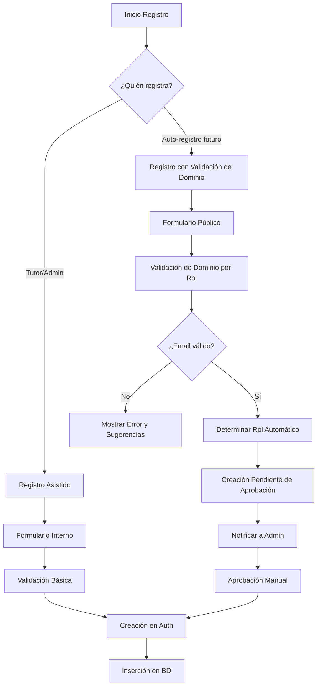
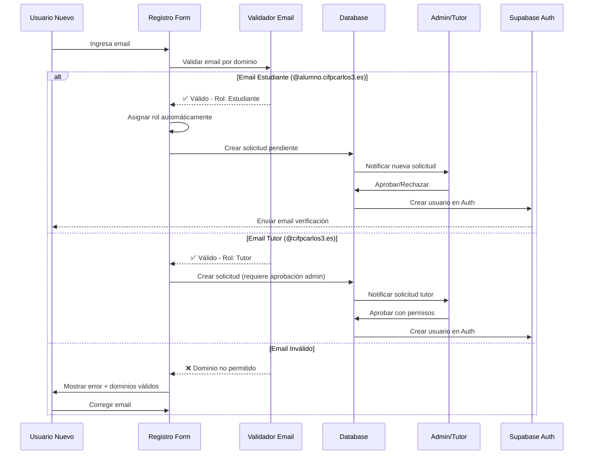
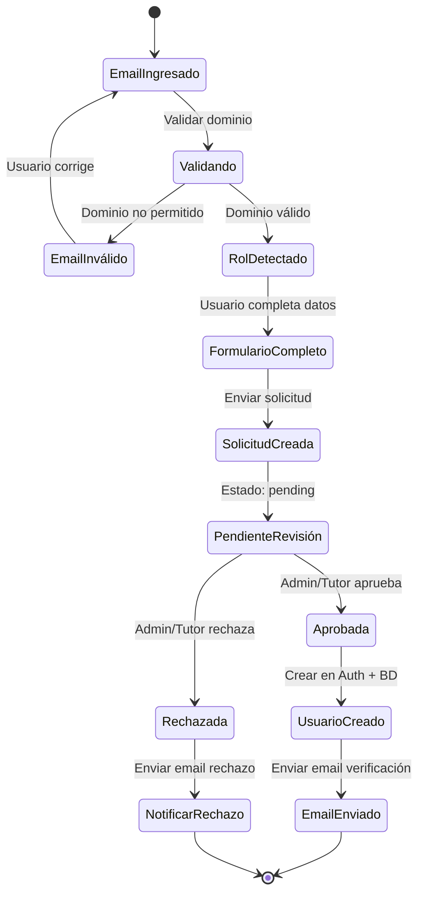

# 🔐 ARQUITECTURA DEL SISTEMA DE REGISTRO DE USUARIOS POR ROLES

**Estado:** 📝 Documentación Técnica (No Implementado)  
**Fecha:** 14 de Noviembre de 2025  
**Versión:** 1.0

---

## 📌 INTRODUCCIÓN

Este documento describe la arquitectura y lógica del sistema de registro de usuarios diferenciado por roles para el Sistema de Seguimiento de Proyectos TFCGS. 

### **Estado Actual del Sistema**

✅ **Implementación Actual:**
- Los **tutores** y **administradores** son los únicos autorizados para crear nuevos usuarios
- Se confía en que estos usuarios privilegiados utilizarán correos válidos y apropiados
- El registro se realiza mediante formularios internos del sistema con validación básica

❌ **No Implementado:**
- Validación automática de dominios de email por rol
- Sistema de auto-registro con validación de dominio
- Verificación preventiva de patrones de correo institucional

### **Justificación de No Implementación**

La validación estricta por patrones de dominio **no se ha implementado** debido a:

1. **Confianza en usuarios privilegiados**: Solo tutores y administradores pueden crear usuarios
2. **Flexibilidad operativa**: Permite casos especiales (correos temporales, correos alternativos)
3. **Costo de desarrollo vs beneficio**: El esfuerzo de implementación no justifica el riesgo actual
4. **Priorización del MVP**: Se enfoca en funcionalidades core del sistema

---

## 🎭 ARQUITECTURA CONCEPTUAL DEL REGISTRO POR ROLES

### **1. VISIÓN GENERAL DEL SISTEMA**



### **2. FLUJOS DE REGISTRO SEGÚN IMPLEMENTACIÓN**

#### **🟢 Flujo Actual (Implementado)**

**Registro Asistido por Tutor/Admin:**

1. **Autenticación**: Tutor o Admin inicia sesión
2. **Navegación**: Accede a formulario de creación de usuario
3. **Completar Datos**: Ingresa email, nombre, contraseña, etc.
4. **Validación Básica**: 
   - Email con formato válido
   - Contraseña con longitud mínima
   - Campos obligatorios completados
5. **Creación**: Sistema crea usuario en Supabase Auth
6. **Inserción BD**: Se almacena en tabla `users`
7. **Confirmación**: Email de verificación enviado (opcional)

**Ventajas:**
- ✅ Simple y directo
- ✅ Control total del proceso
- ✅ Menor complejidad técnica
- ✅ Flexibilidad para casos especiales

**Desventajas:**
- ⚠️ Posibles errores humanos en el email
- ⚠️ No valida automáticamente dominios institucionales
- ⚠️ Requiere intervención manual del tutor/admin

---

#### **🔵 Flujo Propuesto (No Implementado)**

**Registro con Validación Automática de Dominio:**



**Ventajas:**
- ✅ Validación automática de dominios institucionales
- ✅ Asignación automática de roles según email
- ✅ Prevención de registros no autorizados
- ✅ Reducción de errores humanos
- ✅ Proceso escalable

**Desventajas:**
- ❌ Mayor complejidad técnica
- ❌ Requiere mantenimiento de lista de dominios
- ❌ Menos flexibilidad para casos especiales
- ❌ Necesita flujo de aprobación adicional

---

## 📐 ESPECIFICACIÓN TÉCNICA DEL SISTEMA PROPUESTO

### **1. CONFIGURACIÓN DE DOMINIOS PERMITIDOS**

#### **Estudiantes**
| Dominio | Patrón | Ejemplo | Validación Especial |
|---------|--------|---------|---------------------|
| `@alumno.cifpcarlos3.es` | `^[a-zA-Z0-9._%+-]+@alumno\.cifpcarlos3\.es$` | `juan.perez@alumno.cifpcarlos3.es` | Nombre + Apellido |
| `@alu.murciaeduca.es` | `^[0-9]{7}@alu\.murciaeduca\.es$` | `3850437@alu.murciaeduca.es` | 7 dígitos exactos |

**Reglas de Negocio:**
- Solo se aceptan correos institucionales de estudiantes
- El sistema detecta automáticamente el rol "estudiante"
- Requiere aprobación de tutor o administrador
- Se asigna a un tutor por defecto (configurable)

---

#### **Tutores**
| Dominio | Patrón | Ejemplo | Validación Especial |
|---------|--------|---------|---------------------|
| `@cifpcarlos3.es` | `^[a-zA-Z0-9._%+-]+@cifpcarlos3\.es$` | `tutor.garcia@cifpcarlos3.es` | Correo institucional |
| `@jualas.es` | `^[a-zA-Z0-9._%+-]+@jualas\.es$` | `jualas@jualas.es` | Dominio alternativo |

**Reglas de Negocio:**
- Solo se aceptan correos institucionales de profesores
- El sistema detecta automáticamente el rol "tutor"
- **Requiere aprobación obligatoria de administrador**
- Se envía notificación a todos los admins
- Permisos de tutor se activan tras aprobación

---

#### **Administradores**
| Dominio | Patrón | Ejemplo | Validación Especial |
|---------|--------|---------|---------------------|
| `@jualas.es` | `^[a-zA-Z0-9._%+-]+@jualas\.es$` | `admin@jualas.es` | Dominio privilegiado |
| `@admin.cifpcarlos3.es` | `^[a-zA-Z0-9._%+-]+@admin\.cifpcarlos3\.es$` | `superadmin@admin.cifpcarlos3.es` | Dominio admin exclusivo |

**Reglas de Negocio:**
- Solo correos de dominios administrativos
- **NO se permite auto-registro**
- Solo un admin existente puede crear otro admin
- Requiere autenticación de dos factores (futuro)

---

### **2. ESTRUCTURA DE DATOS**

#### **Tabla: `user_registration_requests` (Propuesta)**

```sql
CREATE TABLE user_registration_requests (
  id UUID PRIMARY KEY DEFAULT uuid_generate_v4(),
  email TEXT NOT NULL UNIQUE,
  full_name TEXT NOT NULL,
  detected_role user_role NOT NULL, -- Rol detectado automáticamente
  phone TEXT,
  nre TEXT,
  biography TEXT,
  
  -- Estado de la solicitud
  status TEXT NOT NULL DEFAULT 'pending', -- pending, approved, rejected
  
  -- Metadatos de aprobación
  requested_at TIMESTAMP DEFAULT CURRENT_TIMESTAMP,
  reviewed_at TIMESTAMP,
  reviewed_by UUID REFERENCES auth.users(id),
  rejection_reason TEXT,
  
  -- Datos del usuario creado (tras aprobación)
  created_user_id UUID REFERENCES auth.users(id),
  
  CONSTRAINT valid_status CHECK (status IN ('pending', 'approved', 'rejected'))
);

-- Índices
CREATE INDEX idx_registration_status ON user_registration_requests(status);
CREATE INDEX idx_registration_email ON user_registration_requests(email);
CREATE INDEX idx_registration_requested_at ON user_registration_requests(requested_at DESC);

-- RLS: Solo admins y tutores pueden ver solicitudes
CREATE POLICY "Admin can view all requests"
ON user_registration_requests FOR SELECT
USING (
  EXISTS (
    SELECT 1 FROM users
    WHERE id = auth.uid() AND role = 'admin'
  )
);

CREATE POLICY "Tutors can view student requests"
ON user_registration_requests FOR SELECT
USING (
  detected_role = 'student' AND
  EXISTS (
    SELECT 1 FROM users
    WHERE id = auth.uid() AND role = 'tutor'
  )
);
```

---

### **3. COMPONENTES DEL SISTEMA**

#### **Frontend: Validador de Email**

```dart
// lib/config/email_domain_config.dart

class EmailDomainConfig {
  // Configuración de dominios
  static const Map<String, List<String>> allowedDomains = {
    'student': [
      '@alumno.cifpcarlos3.es',
      '@alu.murciaeduca.es',
    ],
    'tutor': [
      '@cifpcarlos3.es',
      '@jualas.es',
    ],
    'admin': [
      '@jualas.es',
      '@admin.cifpcarlos3.es',
    ],
  };

  // Patrones regex específicos
  static const Map<String, Map<String, String>> patterns = {
    'student': {
      'cifpcarlos3': r'^[a-zA-Z0-9._%+-]+@alumno\.cifpcarlos3\.es$',
      'murciaeduca': r'^[0-9]{7}@alu\.murciaeduca\.es$',
    },
    'tutor': {
      'cifpcarlos3': r'^[a-zA-Z0-9._%+-]+@cifpcarlos3\.es$',
      'jualas': r'^[a-zA-Z0-9._%+-]+@jualas\.es$',
    },
    'admin': {
      'jualas': r'^[a-zA-Z0-9._%+-]+@jualas\.es$',
      'admin_cifp': r'^[a-zA-Z0-9._%+-]+@admin\.cifpcarlos3\.es$',
    },
  };

  /// Detecta el rol basado en el dominio del email
  static String? detectRoleFromEmail(String email) {
    final emailLower = email.toLowerCase().trim();
    
    // Verificar cada rol
    for (final entry in allowedDomains.entries) {
      final role = entry.key;
      final domains = entry.value;
      
      // Verificar si coincide con algún dominio simple
      for (final domain in domains) {
        if (emailLower.endsWith(domain)) {
          return role;
        }
      }
      
      // Verificar patrones regex
      final rolePatterns = patterns[role];
      if (rolePatterns != null) {
        for (final pattern in rolePatterns.values) {
          if (RegExp(pattern).hasMatch(emailLower)) {
            return role;
          }
        }
      }
    }
    
    return null; // Email no válido para ningún rol
  }

  /// Valida si un email es válido para el sistema
  static EmailValidationResult validateEmail(String email) {
    final role = detectRoleFromEmail(email);
    
    if (role == null) {
      return EmailValidationResult(
        isValid: false,
        error: 'El email no pertenece a un dominio institucional válido',
        allowedDomains: _getAllowedDomains(),
      );
    }
    
    return EmailValidationResult(
      isValid: true,
      detectedRole: role,
      allowedDomains: allowedDomains[role],
    );
  }

  static List<String> _getAllowedDomains() {
    final allDomains = <String>[];
    for (final domains in allowedDomains.values) {
      allDomains.addAll(domains);
    }
    return allDomains;
  }
}

/// Resultado de la validación de email
class EmailValidationResult {
  final bool isValid;
  final String? detectedRole;
  final String? error;
  final List<String>? allowedDomains;

  EmailValidationResult({
    required this.isValid,
    this.detectedRole,
    this.error,
    this.allowedDomains,
  });
}
```

---

#### **Backend: Validación Server-Side**

```typescript
// Edge Function: validate-and-create-user

interface EmailDomainConfig {
  student: string[];
  tutor: string[];
  admin: string[];
}

const ALLOWED_EMAIL_DOMAINS: EmailDomainConfig = {
  student: ['@alumno.cifpcarlos3.es', '@alu.murciaeduca.es'],
  tutor: ['@cifpcarlos3.es', '@jualas.es'],
  admin: ['@jualas.es', '@admin.cifpcarlos3.es'],
};

const EMAIL_PATTERNS: Record<string, RegExp[]> = {
  student: [
    /^[a-zA-Z0-9._%+-]+@alumno\.cifpcarlos3\.es$/,
    /^[0-9]{7}@alu\.murciaeduca\.es$/,
  ],
  tutor: [
    /^[a-zA-Z0-9._%+-]+@cifpcarlos3\.es$/,
    /^[a-zA-Z0-9._%+-]+@jualas\.es$/,
  ],
  admin: [
    /^[a-zA-Z0-9._%+-]+@jualas\.es$/,
    /^[a-zA-Z0-9._%+-]+@admin\.cifpcarlos3\.es$/,
  ],
};

/**
 * Detecta el rol basado en el dominio del email
 */
function detectRoleFromEmail(email: string): string | null {
  const emailLower = email.toLowerCase().trim();

  // Verificar estudiantes
  if (EMAIL_PATTERNS.student.some(pattern => pattern.test(emailLower))) {
    return 'student';
  }

  // Verificar tutores
  if (EMAIL_PATTERNS.tutor.some(pattern => pattern.test(emailLower))) {
    return 'tutor';
  }

  // Verificar admins
  if (EMAIL_PATTERNS.admin.some(pattern => pattern.test(emailLower))) {
    return 'admin';
  }

  return null;
}

/**
 * Valida email y retorna información de validación
 */
function validateEmailForRegistration(email: string): {
  valid: boolean;
  detectedRole?: string;
  error?: string;
  allowedDomains?: string[];
} {
  const detectedRole = detectRoleFromEmail(email);

  if (!detectedRole) {
    const allDomains = [
      ...ALLOWED_EMAIL_DOMAINS.student,
      ...ALLOWED_EMAIL_DOMAINS.tutor,
      ...ALLOWED_EMAIL_DOMAINS.admin,
    ];

    return {
      valid: false,
      error: `Email no válido. Dominios permitidos: ${allDomains.join(', ')}`,
      allowedDomains: allDomains,
    };
  }

  return {
    valid: true,
    detectedRole,
    allowedDomains: ALLOWED_EMAIL_DOMAINS[detectedRole as keyof EmailDomainConfig],
  };
}

/**
 * Handler principal de registro
 */
Deno.serve(async (req: Request) => {
  if (req.method === 'POST') {
    const { email, full_name, phone, nre, biography } = await req.json();

    // Validar email
    const validation = validateEmailForRegistration(email);

    if (!validation.valid) {
      return new Response(
        JSON.stringify({
          error: validation.error,
          error_code: 'invalid_email_domain',
          allowed_domains: validation.allowedDomains,
        }),
        {
          status: 400,
          headers: { 'Content-Type': 'application/json' },
        }
      );
    }

    // Crear solicitud de registro
    const { data, error } = await supabaseClient
      .from('user_registration_requests')
      .insert({
        email,
        full_name,
        detected_role: validation.detectedRole,
        phone,
        nre,
        biography,
        status: 'pending',
      })
      .select()
      .single();

    if (error) {
      return new Response(
        JSON.stringify({ error: error.message }),
        { status: 500, headers: { 'Content-Type': 'application/json' } }
      );
    }

    // Enviar notificación a admins/tutores
    await notifyAdminsOfNewRequest(data);

    return new Response(
      JSON.stringify({
        success: true,
        message: 'Solicitud de registro creada. Recibirás un email cuando sea aprobada.',
        request_id: data.id,
        detected_role: validation.detectedRole,
      }),
      { status: 201, headers: { 'Content-Type': 'application/json' } }
    );
  }

  return new Response('Method not allowed', { status: 405 });
});
```

---

### **4. INTERFAZ DE USUARIO**

#### **Formulario de Registro Público (Propuesta)**

```dart
// lib/screens/auth/public_registration_screen.dart

class PublicRegistrationScreen extends StatefulWidget {
  @override
  _PublicRegistrationScreenState createState() => _PublicRegistrationScreenState();
}

class _PublicRegistrationScreenState extends State<PublicRegistrationScreen> {
  final _formKey = GlobalKey<FormState>();
  final _emailController = TextEditingController();
  String? _detectedRole;
  bool _isValidating = false;

  @override
  Widget build(BuildContext context) {
    return Scaffold(
      appBar: AppBar(title: Text('Solicitar Acceso')),
      body: Padding(
        padding: EdgeInsets.all(16),
        child: Form(
          key: _formKey,
          child: Column(
            children: [
              // Instrucciones
              Card(
                color: Colors.blue[50],
                child: Padding(
                  padding: EdgeInsets.all(16),
                  child: Column(
                    crossAxisAlignment: CrossAxisAlignment.start,
                    children: [
                      Row(
                        children: [
                          Icon(Icons.info_outline, color: Colors.blue[700]),
                          SizedBox(width: 8),
                          Text(
                            'Registro con Email Institucional',
                            style: TextStyle(
                              fontWeight: FontWeight.bold,
                              color: Colors.blue[900],
                            ),
                          ),
                        ],
                      ),
                      SizedBox(height: 8),
                      Text(
                        'Solo se permiten correos institucionales. El sistema detectará automáticamente tu rol según tu dominio de email.',
                        style: TextStyle(fontSize: 14),
                      ),
                    ],
                  ),
                ),
              ),
              
              SizedBox(height: 24),
              
              // Campo de email con validación en tiempo real
              ValidatedEmailField(
                controller: _emailController,
                onValidationChanged: (result) {
                  setState(() {
                    _detectedRole = result.detectedRole;
                  });
                },
              ),
              
              // Mostrar rol detectado
              if (_detectedRole != null) ...[
                SizedBox(height: 16),
                Container(
                  padding: EdgeInsets.all(12),
                  decoration: BoxDecoration(
                    color: Colors.green[50],
                    border: Border.all(color: Colors.green[300]!),
                    borderRadius: BorderRadius.circular(8),
                  ),
                  child: Row(
                    children: [
                      Icon(Icons.check_circle, color: Colors.green[700]),
                      SizedBox(width: 8),
                      Expanded(
                        child: Text(
                          'Rol detectado: ${_getRoleName(_detectedRole!)}',
                          style: TextStyle(
                            fontWeight: FontWeight.w500,
                            color: Colors.green[900],
                          ),
                        ),
                      ),
                    ],
                  ),
                ),
              ],
              
              // Resto del formulario...
              // (Nombre, teléfono, etc.)
              
              SizedBox(height: 24),
              
              // Botón de envío
              ElevatedButton(
                onPressed: _submitRequest,
                child: Text('Solicitar Acceso'),
              ),
            ],
          ),
        ),
      ),
    );
  }

  String _getRoleName(String role) {
    switch (role) {
      case 'student':
        return 'Estudiante';
      case 'tutor':
        return 'Tutor';
      case 'admin':
        return 'Administrador';
      default:
        return role;
    }
  }

  Future<void> _submitRequest() async {
    // Lógica de envío...
  }
}
```

---

## 🔄 FLUJO COMPLETO: Desde Registro hasta Aprobación

### **Diagrama de Estados de una Solicitud**



---

## 📊 COMPARATIVA: Implementación Actual vs Propuesta

| Aspecto | **Actual (Implementado)** | **Propuesto (No Implementado)** |
|---------|---------------------------|----------------------------------|
| **Creación de usuarios** | Tutor/Admin mediante formulario | Auto-registro + Aprobación |
| **Validación de email** | Formato básico | Dominio institucional específico |
| **Asignación de rol** | Manual | Automática según dominio |
| **Seguridad** | Confianza en admin/tutor | Validación multi-capa |
| **Escalabilidad** | Requiere intervención manual | Parcialmente automatizado |
| **Flexibilidad** | ✅ Alta (permite casos especiales) | ⚠️ Media (requiere dominios válidos) |
| **Complejidad técnica** | ✅ Baja | ❌ Alta |
| **Tiempo de implementación** | ✅ Inmediato | ⏱️ 2-3 semanas |
| **Mantenimiento** | ✅ Mínimo | ⚠️ Medio (actualizar dominios) |
| **Experiencia de usuario** | ⚠️ Requiere admin/tutor | ✅ Auto-servicio (con aprobación) |

---

## 🎯 CASOS DE USO

### **Caso 1: Estudiante Nuevo Solicita Acceso**

**Escenario:**
- Juan Pérez es un nuevo estudiante de DAM
- Tiene email institucional: `juan.perez@alumno.cifpcarlos3.es`
- Quiere acceder al sistema para gestionar su proyecto

**Flujo (Sistema Propuesto):**

1. Juan accede a la página de registro público
2. Ingresa su email `juan.perez@alumno.cifpcarlos3.es`
3. Sistema valida el dominio → ✅ Válido para estudiantes
4. Sistema detecta automáticamente: **Rol = Estudiante**
5. Juan completa el resto del formulario (nombre, NRE, teléfono)
6. Envía la solicitud
7. Sistema crea registro en `user_registration_requests` con estado `pending`
8. Sistema notifica a todos los tutores disponibles
9. Un tutor revisa la solicitud y la aprueba
10. Sistema crea usuario en Supabase Auth
11. Sistema inserta en tabla `users`
12. Juan recibe email de verificación
13. Juan puede iniciar sesión

**Tiempo estimado:** 24-48 horas (depende de revisión del tutor)

---

### **Caso 2: Tutor Intenta Auto-Registrarse**

**Escenario:**
- María García es nueva tutora
- Email: `maria.garcia@cifpcarlos3.es`
- Necesita acceso al sistema

**Flujo (Sistema Propuesto):**

1. María accede al registro público
2. Ingresa `maria.garcia@cifpcarlos3.es`
3. Sistema valida → ✅ Válido para tutores
4. Sistema detecta: **Rol = Tutor**
5. Sistema muestra advertencia: "Las solicitudes de tutor requieren aprobación de un administrador"
6. María completa el formulario
7. Envía solicitud
8. Sistema crea registro con estado `pending`
9. **Notificación solo a administradores** (no a otros tutores)
10. Un administrador revisa credenciales de María
11. Administrador aprueba y asigna permisos específicos
12. María recibe email de confirmación
13. María puede iniciar sesión como tutor

**Tiempo estimado:** 48-72 horas (requiere validación administrativa)

---

### **Caso 3: Email No Válido**

**Escenario:**
- Carlos intenta registrarse con `carlos@gmail.com`

**Flujo:**

1. Carlos ingresa `carlos@gmail.com`
2. Sistema valida → ❌ Dominio no permitido
3. Sistema muestra:
   ```
   ❌ Email no válido
   
   Este sistema solo acepta correos institucionales.
   Dominios permitidos:
   
   Para estudiantes:
   • @alumno.cifpcarlos3.es
   • @alu.murciaeduca.es
   
   Para tutores:
   • @cifpcarlos3.es
   • @jualas.es
   
   ¿No tienes email institucional?
   Contacta con la secretaría del centro.
   ```
4. Carlos no puede continuar sin un email válido

---

## 🔒 CONSIDERACIONES DE SEGURIDAD

### **Vectores de Ataque Prevenidos**

1. **Registro No Autorizado**
   - ✅ Solo emails institucionales permitidos
   - ✅ Validación server-side obligatoria
   - ✅ Aprobación manual para tutores y admins

2. **Spoofing de Rol**
   - ✅ Rol detectado automáticamente por dominio
   - ✅ Usuario no puede elegir su propio rol
   - ✅ Validación en múltiples capas

3. **SQL Injection**
   - ✅ Uso de prepared statements en Supabase
   - ✅ Validación de entrada en Edge Functions

4. **Email Bombing**
   - ✅ Rate limiting en Edge Functions
   - ✅ Límite de solicitudes por IP
   - ✅ Verificación CAPTCHA (opcional)

### **Vulnerabilidades Residuales**

⚠️ **Confianza en Admins/Tutores**
- Si un admin/tutor está comprometido, puede aprobar solicitudes maliciosas
- **Mitigación:** Auditoría de todas las aprobaciones, logs detallados

⚠️ **Dominios Compartidos**
- Si un dominio es usado por múltiples roles (ej: `@jualas.es`)
- **Mitigación:** Patrones regex más específicos, validación adicional

⚠️ **Cambio de Email Post-Registro**
- Usuario podría cambiar su email después del registro
- **Mitigación:** Validar nuevamente al cambiar email, notificar a admin

---

## 🚀 PLAN DE IMPLEMENTACIÓN (Futuro)

### **Fase 1: Preparación (1 semana)**
- [ ] Definir lista completa de dominios institucionales
- [ ] Crear tabla `user_registration_requests`
- [ ] Implementar configuración `EmailDomainConfig`
- [ ] Escribir tests unitarios de validación

### **Fase 2: Backend (1 semana)**
- [ ] Crear Edge Function `validate-and-create-registration-request`
- [ ] Implementar validación server-side
- [ ] Crear función de notificación a admins/tutores
- [ ] Implementar endpoints de aprobación/rechazo
- [ ] Configurar RLS en tabla de solicitudes

### **Fase 3: Frontend (1 semana)**
- [ ] Crear `PublicRegistrationScreen`
- [ ] Implementar `ValidatedEmailField`
- [ ] Crear pantalla de gestión de solicitudes (admin/tutor)
- [ ] Implementar notificaciones en tiempo real
- [ ] Crear flujo de aprobación/rechazo

### **Fase 4: Testing y Despliegue (1 semana)**
- [ ] Tests de integración
- [ ] Tests de validación de dominios
- [ ] Tests de flujos completos
- [ ] Documentación de usuario
- [ ] Despliegue gradual (beta con usuarios seleccionados)

**Tiempo total estimado:** 4 semanas  
**Esfuerzo:** 1 desarrollador full-time

---

## 📝 DECISIÓN FINAL

### **¿Por qué NO se implementa ahora?**

1. **Priorización del MVP**
   - El sistema actual cumple con los requisitos mínimos
   - Tutores y admins pueden crear usuarios sin problemas
   - No hay casos reportados de emails erróneos

2. **Relación Costo-Beneficio**
   - Implementación: 4 semanas de desarrollo
   - Beneficio: Automatización parcial (aún requiere aprobación)
   - Alternativa: Capacitar a tutores/admins (2 horas)

3. **Flexibilidad Operativa**
   - Sistema actual permite casos especiales fácilmente
   - Correos temporales para invitados
   - Correos externos para colaboradores

4. **Complejidad de Mantenimiento**
   - Requiere actualizar lista de dominios periódicamente
   - Más puntos de falla
   - Más código que mantener

### **¿Cuándo se debería implementar?**

✅ **Implementar SI:**
- Hay más de 50 registros mensuales
- Se detectan múltiples errores de email
- Hay requisitos de auditoría estrictos
- Se abre el sistema a auto-registro público
- Se necesita escalabilidad automática

❌ **NO Implementar SI:**
- Menos de 20 registros mensuales
- Equipo de tutores/admins pequeño y confiable
- Sistema no está abierto al público
- Recursos de desarrollo limitados

---

## 📚 REFERENCIAS Y RECURSOS

### **Documentación Relacionada**
- [Arquitectura del Sistema de Autenticación](./login.md)
- [Gestión de Usuarios](../desarrollo/flujo_gestion_contraseñas.md)
- [Configuración de Email](../desarrollo/configuracion_email_verificacion.md)

### **Recursos Técnicos**
- [Supabase Auth Documentation](https://supabase.com/docs/guides/auth)
- [Email Validation Best Practices](https://en.wikipedia.org/wiki/Email_address#Validation_and_verification)
- [OWASP Authentication Cheat Sheet](https://cheatsheetseries.owasp.org/cheatsheets/Authentication_Cheat_Sheet.html)

---

## 📞 CONTACTO Y SOPORTE

**Para consultas sobre este documento:**
- Revisar la implementación actual en `frontend/lib/services/user_management_service.dart`
- Consultar formularios de creación en `frontend/lib/widgets/forms/`
- Verificar configuración de Supabase Auth en el dashboard

**Última actualización:** 14 de Noviembre de 2025  
**Versión del documento:** 1.0  
**Estado:** Documentación Técnica (No Implementado)

