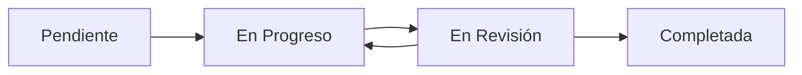

# 📚 Guía de Uso - Estudiante

**Sistema de Seguimiento de Proyectos TFCGS**  
**Versión:** 1.0  
**Fecha:** Noviembre 2025

---

## 🎯 Tu Rol como Estudiante

Como **estudiante**, eres el responsable principal de:
- Crear y gestionar tu **anteproyecto**
- **Crear y gestionar tus propias tareas** del proyecto
- Mantener actualizado el progreso de tu proyecto
- Comunicarte con tu tutor sobre el avance

---

## 🔐 Acceso al Sistema

**Importante sobre el registro:**
- Tu cuenta es creada por el **administrador del sistema**
- El sistema está configurado para aceptar únicamente emails del **dominio institucional** (ej: @jualas.es)
- No puedes registrarte por tu cuenta; debes recibir tus credenciales del administrador
- Si necesitas acceso, contacta al administrador del sistema

**Credenciales:**
- Recibirás tu email y contraseña inicial del administrador
- Si olvidas tu contraseña, debes solicitarla al administrador o tutor (no puedes cambiarla tú mismo)

---

## 📋 Lógica de Negocio: Flujo de Trabajo del Estudiante

### **Fase 1: Creación del Anteproyecto** 📝

```
1. Tienes una idea de proyecto
   ↓
2. Creas un anteproyecto en la sección "Anteproyectos"
   ↓
3. Completas toda la información requerida:
   • Título del proyecto
   • Descripción detallada
   • Objetivos
   • Tecnologías a utilizar
   ↓
4. Envías el anteproyecto a revisión
   ↓
5. Esperas la respuesta de tu tutor
```

**Estados posibles de tu anteproyecto:**
- 🟡 **Pendiente**: Esperando revisión del tutor
- 🟢 **Aprobado**: ¡Felicidades! Puedes empezar con el proyecto
- 🔴 **Rechazado**: Revisa los comentarios del tutor y mejora tu propuesta
- 🔵 **En Revisión**: El tutor está evaluando tu anteproyecto

---

### **Fase 2: Trabajo en el Proyecto** 🚀

Una vez aprobado tu anteproyecto:

```
1. Tu anteproyecto se convierte en un proyecto activo
   ↓
2. Creas tus propias tareas para organizar el trabajo
   ↓
3. Trabajas en cada tarea según prioridad
   ↓
4. Actualizas el estado de tus tareas
   ↓
5. Gestionas el progreso de tus tareas de forma autónoma
   ↓
6. Comunicas el avance del proyecto a tu tutor cuando sea necesario
```

---

### **Fase 3: Gestión de Tareas** ✅

**Ciclo de vida de una tarea:**



**Tus responsabilidades:**
1. **Crear tus propias tareas**: Define el trabajo que necesitas realizar
2. **Cambiar estado**: Cuando empieces a trabajar, marca como "En Progreso"
3. **Revisar tu trabajo**: Cuando termines, marca como "En Revisión" para revisarlo tú mismo
4. **Marcar como completada**: Una vez revisada y satisfecho con el resultado, marca como "Completada"
5. **Actualizar progreso**: Mantén informado a tu tutor sobre el avance general del proyecto

---

## 🗺️ Navegación: Menú Principal

### **🏠 Dashboard (Panel Principal)**
Tu vista inicial que te da la bienvenida y te orienta sobre los siguientes pasos.

**Estructura del Dashboard:**

1. **Barra superior (azul):**
   - **Izquierda**: Ícono de menú hamburguesa (☰) + Ícono de graduación + Título "Dashboard Estudiante"
   - **Derecha**: 
     - 🌐 **Idioma** (ícono de globo) - Cambiar entre español/inglés
     - 🔔 **Notificaciones** (ícono de campana)
     - 💬 **Mensajes/Chat con tu tutor** (ícono de mensaje) - Accede al sistema de mensajes
     - 🚪 **Cerrar sesión** (ícono de salida)

2. **Tarjeta de información del usuario (azul):**
   - Tu nombre completo
   - Tu email
   - Tu rol (Estudiante)

3. **Sección "Comenzar" (blanca):**
   - 📋 **Guía rápida de uso** con información sobre:
     - **Menú principal**: Cómo navegar entre Anteproyectos, Proyectos, Tareas y Tablero Kanban desde el menú hamburguesa
     - **Barra superior**: Uso del ícono de idioma, el ícono de campana para notificaciones y el ícono de mensaje para comunicarte con tu tutor
     - **Flujo básico**: Pasos para crear anteproyecto, trabajar en proyectos y gestionar tareas
     - **Consejos**: Recomendaciones para mantener tareas actualizadas y comunicarte con tu tutor

**Menú hamburguesa (Drawer):**

Al hacer clic en el ícono ☰ de la esquina superior izquierda, se abre el drawer con las siguientes opciones (en este orden):

1. 🏠 **Panel Principal** - Volver al Dashboard
2. 🔔 **Notificaciones** - Ver todas tus notificaciones
3. 💬 **Mensajes** - Acceder al sistema de mensajes con tu tutor
4. 📋 **Anteproyectos** - Gestionar tus anteproyectos
5. 📁 **Proyectos** - Ver tus proyectos aprobados
6. ✅ **Tareas** - Gestionar tus tareas
7. 📊 **Tablero Kanban** - Visualización ágil de tareas
8. ❓ **Guía de Uso** - Acceso a la documentación

**¿Cuándo usarlo?**  
Al iniciar sesión, para recordar en qué fase estás y qué debes hacer a continuación.

---

### **📋 Anteproyectos**
Gestiona tus propuestas de proyecto.

**¿Qué puedes hacer?**
- ✏️ **Crear nuevo anteproyecto**
- 👁️ **Ver estado** de anteproyectos anteriores
- ✍️ **Editar** anteproyectos rechazados
- 📨 **Reenviar** anteproyectos mejorados

**Consejos:**
- Sé específico en la descripción
- Define objetivos claros y medibles
- Investiga las tecnologías antes de proponerlas
- Revisa ejemplos de años anteriores

---

### **📁 Proyectos**
Visualiza tu proyecto aprobado.

**¿Qué encontrarás?**
- Información completa del proyecto
- Estado actual
- Descripción y objetivos
- Tecnologías aprobadas
- **Cronograma de entregas**: Asignado por tu tutor cuando aprueba el anteproyecto

**Importante:**  
Solo verás proyectos que han sido aprobados por tu tutor. El cronograma de entregas es establecido por tu tutor durante el proceso de aprobación del anteproyecto.

---

### **✅ Tareas**
Crea y gestiona todas tus propias tareas del proyecto.

**Vista de tareas:**
- 📋 Lista completa de tus tareas creadas
- 🎯 Estado de cada tarea
- 📅 Fechas límite que tú defines
- 🏷️ Prioridad (Alta, Media, Baja) que tú estableces
- 📝 Descripción detallada que tú escribes

**Acciones disponibles:**
1. **Crear nueva tarea**: Define el trabajo que necesitas realizar
2. **Ver detalle**: Haz clic en una tarea para ver toda la información
3. **Editar tarea**: Modifica título, descripción, fecha límite o prioridad
4. **Cambiar estado**: 
   - Pendiente → En Progreso
   - En Progreso → En Revisión
5. **Agregar comentarios**: Comunícate con tu tutor sobre la tarea
6. **Eliminar tarea**: Si ya no es necesaria

---

### **📊 Tablero Kanban**
Visualización ágil de tus tareas.

**Columnas del tablero:**
- 📥 **Pendiente**: Tareas por empezar
- 🔄 **En Progreso**: Tareas en las que estás trabajando
- 👀 **En Revisión**: Tareas que has completado y quieres revisar antes de marcarlas como finalizadas
- ✅ **Completada**: Tareas finalizadas

**¿Cómo usarlo?**
1. Arrastra tareas entre columnas para cambiar su estado
2. Visualiza rápidamente tu carga de trabajo
3. Prioriza qué tareas abordar primero
4. Identifica cuellos de botella

**Buena práctica:**  
Revisa tu tablero Kanban al inicio de cada sesión de trabajo.

---

### **🔔 Notificaciones**
Mantente informado de todos los eventos importantes.

**Tipos de notificaciones:**
- ✅ **Anteproyecto aprobado**: Tu propuesta fue aceptada
- ❌ **Anteproyecto rechazado**: Revisa los comentarios del tutor
- 💬 **Mensaje del tutor**: Tu tutor te ha enviado un mensaje
- ⏰ **Fecha límite próxima**: Una tarea está por vencer
- 📋 **Actualización del proyecto**: Cambios en tu proyecto

**Recomendación:**  
Revisa tus notificaciones al menos una vez al día.

---

## 💡 Mejores Prácticas

### **✅ Recomendaciones Generales**

1. **Revisa el sistema diariamente**
   - Verifica nuevas tareas
   - Lee notificaciones
   - Actualiza el estado de tu trabajo

2. **Comunícate proactivamente**
   - Si tienes dudas, pregunta en los comentarios de la tarea
   - Informa si vas a tener retrasos
   - Comparte tus avances parciales

3. **Organiza tu tiempo**
   - Usa el tablero Kanban para planificar tu semana
   - Prioriza tareas con fecha límite cercana
   - Divide tareas grandes en subtareas más manejables

4. **Mantén actualizado el estado de tus tareas**
   - Cambia a "En Progreso" cuando empieces
   - Envía a "En Revisión" cuando termines
   - No dejes tareas estancadas sin actualizar

5. **Sé profesional en tu comunicación**
   - Escribe comentarios claros y completos
   - Usa un lenguaje profesional
   - Agradece el feedback de tu tutor

---

### **⚠️ Errores Comunes a Evitar**

❌ **NO hagas:**
- Crear anteproyectos sin investigar previamente
- Dejar tareas en "Pendiente" cuando ya estás trabajando en ellas
- Ignorar los comentarios del tutor
- Esperar hasta el último día para completar tareas
- Marcar tareas como "Completadas" sin enviarlas a revisión primero

✅ **SÍ haz:**
- Investiga antes de proponer un proyecto
- Actualiza el estado de tus tareas en tiempo real
- Lee y aplica el feedback recibido
- Trabaja con anticipación
- Sigue el flujo de estados correcto

---

## 🔧 Solución de Problemas Comunes

### **Problema 1: No veo mi proyecto aprobado**
**Posibles causas:**
- Tu anteproyecto aún está en revisión
- Tu anteproyecto fue rechazado
- Hay un problema de sincronización

**Solución:**
1. Ve a la sección "Anteproyectos"
2. Verifica el estado de tu anteproyecto
3. Si está "Aprobado" pero no aparece en "Proyectos", contacta a tu tutor

---

### **Problema 2: No puedo cambiar el estado de una tarea**
**Posibles causas:**
- La tarea tiene restricciones de estado
- Falta información requerida
- Problema de permisos

**Solución:**
1. Verifica que estés siguiendo el flujo correcto de estados
2. Asegúrate de haber completado todos los campos requeridos
3. Si el problema persiste, contacta a tu tutor

---

### **Problema 3: No recibo notificaciones**
**Posibles causas:**
- Las notificaciones están deshabilitadas
- Problema de conexión
- Configuración de email incorrecta

**Solución:**
1. Revisa la configuración de notificaciones en tu perfil
2. Verifica tu conexión a internet
3. Confirma que tu email esté verificado
4. Consulta la sección de notificaciones manualmente

---

## 📞 ¿Necesitas Ayuda?

### **Contacto con tu Tutor**
Tu tutor es tu primera línea de soporte:
- Usa los comentarios en tareas para preguntas específicas
- Solicita reuniones si necesitas orientación
- Consulta durante las horas de tutoría

### **Soporte Técnico**
Para problemas técnicos del sistema:
- Contacta al administrador del sistema
- Reporta bugs o errores
- Solicita nuevas funcionalidades

---

## 🎓 Consejos para el Éxito

### **🌟 Cómo destacar en tu proyecto**

1. **Planifica bien desde el inicio**
   - Dedica tiempo a tu anteproyecto
   - Investiga tecnologías antes de proponerlas
   - Define objetivos realistas pero ambiciosos

2. **Mantén un ritmo constante**
   - Trabaja un poco cada día
   - No dejes todo para el final
   - Usa el sistema para organizarte

3. **Comunícate efectivamente**
   - Mantén informado a tu tutor
   - Pide ayuda cuando la necesites
   - Acepta y aplica el feedback

4. **Documenta tu trabajo**
   - Actualiza regularmente el progreso
   - Añade comentarios explicativos
   - Guarda evidencias de tu trabajo

5. **Sé proactivo**
   - Anticipa problemas
   - Propón soluciones
   - Toma iniciativa en tu aprendizaje

---

## 📊 Métricas de Éxito

**Indicadores de que lo estás haciendo bien:**
- ✅ Todas tus tareas están actualizadas
- ✅ Entregas antes de la fecha límite
- ✅ Recibes feedback positivo de tu tutor
- ✅ Tu anteproyecto fue aprobado en el primer intento
- ✅ Completas tareas según lo planificado
- ✅ Tienes pocas tareas que requieren cambios

---

## 📖 Glosario

**Anteproyecto:** Propuesta inicial de proyecto que debe ser aprobada por tu tutor antes de empezar a trabajar.

**Tarea:** Unidad de trabajo específica que tú creas para organizar y gestionar tu proyecto de forma autónoma.

**Tablero Kanban:** Herramienta visual que muestra tus tareas organizadas por estado.

**Dashboard:** Panel principal con resumen de tu actividad y proyecto.

**Estado de tarea:** Fase actual en la que se encuentra una tarea (Pendiente, En Progreso, En Revisión, Completada).

**Tutor:** Profesor asignado que supervisa tu proyecto, revisa y aprueba anteproyectos, y proporciona orientación cuando la solicitas.

---

**¿Listo para empezar?** 🚀  
¡Navega al Dashboard y comienza tu viaje en el desarrollo de tu proyecto!

---

**Última actualización:** Noviembre 2025  
**Versión de la aplicación:** Flutter + Supabase FCT  
**Soporte:** Contacta a tu tutor o administrador del sistema

